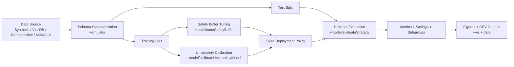

# Anesthesia Emergence Optimizer

<div align="center">


**Safety-aware simulation and optimization for anesthesia stop-timing**  
Predict patient emergence and recommend infusion stop times that reduce wake delay while strongly penalizing early-emergence risk.

</div>

---

## Table of Contents

- [Project Snapshot](#project-snapshot)
- [Why This Project Matters](#why-this-project-matters)
- [What I Built](#what-i-built)
- [System Architecture](#system-architecture)
- [Model and Optimization (Technical Core)](#model-and-optimization-technical-core)
- [Repository Structure](#repository-structure)
- [Quick Start](#quick-start)
- [Configuration](#configuration)
- [Data Pipeline and ETL](#data-pipeline-and-etl)
- [Outputs and Figures](#outputs-and-figures)
- [Validation and Testing](#validation-and-testing)
- [Reproducibility and Engineering Choices](#reproducibility-and-engineering-choices)
- [Interview Talking Points](#interview-talking-points)
- [Limitations and Responsible Use](#limitations-and-responsible-use)
- [Project Documents](#project-documents)

---

## Project Snapshot

> **Problem:** OR teams often face avoidable wake-up delay after surgery because infusion stop-timing is conservative and not individualized.  
> **Approach:** Use interpretable PK/PD simulation + safety-first optimization to personalize stop timing.  
> **Primary objective:** Improve operational efficiency **without** relaxing safety constraints.

### At a glance

- **Type:** End-to-end technical portfolio project (simulation + optimization + communication)
- **Core stack:** MATLAB (modeling/evaluation/visualization), Python (ETL)
- **Data modes:** `synthetic`, `vitaldb`, `retrospective`, `mimic-iv`
- **Optimizer modes:** `robust-explainable` (default), `legacy-bisection`
- **Evaluation style:** Train/test split with uncertainty-aware held-out evaluation

---

## Why This Project Matters

This project sits at the intersection of:

- **Clinical safety constraints** (avoid early emergence)
- **Operations optimization** (reduce wake delay and downstream schedule pressure)
- **Explainable decision support** (transparent equations, interpretable policy knobs)

For interviewers, this demonstrates ability to ship an idea from **mathematical model** to **evaluation pipeline** to **stakeholder-ready outputs**.

---

## What I Built

### 1) PK/PD simulation engine

- Schnider-style 3-compartment model with effect-site dynamics
- Patient covariate support (age, weight, BMI, sex, LBM, procedure profile)
- Emergence threshold logic and configurable simulation resolution

### 2) Safety-aware optimization policy

- Recommends infusion stop-time to hit target wake delay after surgery end
- Uses asymmetric objective with strong early-wake penalty (default weight = 12)
- Includes conservative correction if a candidate still wakes too early

### 3) Uncertainty-aware evaluation

- Train/test separation to avoid tuning leakage
- Uncertainty calibration and perturbed realization evaluation
- Subgroup performance and penalty sensitivity analysis

### 4) Communication layer

- Technical figures and stakeholder-facing visuals
- Exported CSV summary artifacts
- Dedicated scripts for pitch-deck quality plots

---

## System Architecture



---

## Model and Optimization (Technical Core)

### PK/PD dynamics

The optimizer queries a simulator with states $C_1, C_2, C_3, C_e$:

$$
\frac{dC_1}{dt}=\frac{u}{V_1}-(k_{10}+k_{12}+k_{13})C_1+k_{21}C_2+k_{31}C_3
$$

$$
\frac{dC_2}{dt}=k_{12}C_1-k_{21}C_2,\quad
\frac{dC_3}{dt}=k_{13}C_1-k_{31}C_3,\quad
\frac{dC_e}{dt}=k_{e0}(C_1-C_e)
$$

Wake-time proxy:

$$
T_{wake}(t_{stop}) = \min\{t \ge t_{stop}: C_e(t) \le C_{e,thr}\}
$$

### Safety-weighted objective

Define timing error relative to target wake time as $\epsilon = T_{wake} - T_{target}$.  
Loss is asymmetric:

$$
\mathcal{L}(t_{stop}) = w_{early}\,\max(-\epsilon,0)^2 + \max(\epsilon,0)^2
$$

with $w_{early}=12$ (default), making early wake-up significantly more costly than late wake-up.

### Policy design choices

- **Conservative by design:** explicit post-search correction delays stop-time if early wake risk remains
- **Fast and deterministic:** bisection-style search and fixed seed for reproducibility
- **Explainable controls:** clear knobs (`penalty`, `buffer`, `target delay`, `threshold`)

---

## Repository Structure

```text
.
├─ main.m
├─ setupProject.m
├─ makeStakeholderPlot.m
├─ makeStakeholderAlgorithmPlot.m
├─ +emulator/    # data generation/loaders/schema standardization
├─ +model/       # PK/PD, optimization, uncertainty, evaluation
├─ +viz/         # technical and stakeholder visualizations
├─ +utils/       # logging, parallel config, figure export helpers
├─ etl/          # Python ETL scripts and SQL templates
├─ data/         # train/test cohorts, tuning artifacts, summaries
├─ figures/      # generated figure outputs
├─ tests/        # PK invariants + regression checks
└─ explanations/ # technical and stakeholder documentation
```

---

## Quick Start

### MATLAB full pipeline

1. Open MATLAB in repository root.
2. (Optional) set environment variables.
3. Run:

```matlab
setupProject
main
```

This runs data load/generation, train/test workflow, tuning/evaluation logic, and figure generation.

### Generate stakeholder-ready plot only

If `data/testPatients.csv` already exists:

```matlab
setupProject
makeStakeholderPlot
```

### Run test suite

```matlab
tests.runAllTests
```

---

## Configuration

Environment variables consumed by `main.m`:

| Variable | Allowed values | Default | Purpose |
|---|---|---|---|
| `AEP_DATA_SOURCE` | `synthetic`, `vitaldb`, `retrospective`, `mimic-iv` | `vitaldb` | Select cohort source |
| `AEP_OPTIMIZER_MODE` | `robust-explainable`, `legacy-bisection` | `robust-explainable` | Choose optimizer implementation |
| `AEP_PARALLEL_WORKERS` | Integer | auto | Parallelism control |
| `AEP_RUN_EXPENSIVE_TUNING` | `true` / `false` | `false` | Enable full tuning sweeps |
| `AEP_USE_TUNING_CACHE` | `true` / `false` | `true` | Reuse matched tuning cache |
| `AEP_TUNING_CACHE_REFRESH` | `true` / `false` | `false` | Force refresh cached tuning |
| `AEP_FIXED_BUFFER_MIN` | Numeric minutes | unset | Bypass tuning with fixed safety buffer |

Example:

```matlab
setenv('AEP_DATA_SOURCE','vitaldb')
setenv('AEP_OPTIMIZER_MODE','robust-explainable')
setenv('AEP_RUN_EXPENSIVE_TUNING','false')
setenv('AEP_PARALLEL_WORKERS','8')
setupProject
main
```

---

## Data Pipeline and ETL

Python dependencies:

```bash
pip install -r requirements.txt
```

Build de-identified VitalDB cohort:

```bash
python etl/build_deidentified_cohort.py --source vitaldb-lib --output data/vitaldb_cases.csv --detailed-output data/vitaldb_detailed_cases.csv
```

More ETL details are in `etl/RUN_ETL.md`.

---

## Outputs and Figures

Typical outputs include:

- Cohort and tuning files in `data/`
- Generated visual outputs under timestamped folders in `figures/`
- Stakeholder plots (PNG + FIG) for presentations

Common visualization entry points:

- `viz.plotComparison`
- `viz.plotStakeholderHero`
- `makeStakeholderPlot`
- `makeStakeholderAlgorithmPlot`

---

## Validation and Testing

Current tests focus on model behavior and regression stability:

- `tests/testPKInvariants.m`
- `tests/testRegressionSnapshot.m`
- `tests/runAllTests.m`

Validation philosophy:

- Tune policy on train split only
- Evaluate fixed policy on held-out test split
- Include uncertainty perturbations for more credible performance estimates

---

## Reproducibility and Engineering Choices

- Deterministic random seed for repeatable runs
- Explicit train/test partitioning
- Cache-aware expensive tuning (`data/tuning_cache/`)
- Parallel execution controls for runtime management
- Modular package structure for clear separation of concerns

---

## Interview Talking Points

If you're reviewing this as a portfolio project, key points to discuss are:

1. **Clinical-to-technical translation:** turning a safety-critical workflow problem into a formal optimization objective
2. **Risk-aware optimization:** asymmetric penalties and conservative correction layers
3. **Evaluation discipline:** avoiding leakage and stress-testing under uncertainty
4. **Product thinking:** converting technical outputs into stakeholder artifacts and operational narrative
5. **Engineering quality:** reproducibility, test harness, modularity, and configuration-driven experimentation

---

## Limitations and Responsible Use

> This repository is a **research/portfolio prototype**, not a bedside control system.

- Not clinically validated for autonomous patient-care decisions
- Intended for simulation, analysis, and communication of decision-support concepts
- Requires proper prospective validation, regulatory review, and governance before any clinical deployment

---

## Project Documents

Technical and stakeholder documentation is in `explanations/`:

- `PROJECT_EXPLANATION.md`
- `OPTIMISATION_EQUATIONS.md`
- `OPTIMISATION_MODEL_UPGRADE.md`
- `EXECUTIVE_BRIEFING.md`
- `CLINICAL_DATA_WORKFLOW.md`
- `STAKEHOLDER_PRESENTATION_GUIDE.md`
- `VISUAL_PRESENTATION_CONCEPTS.md`

---

## Author

**J Frusher**  
Portfolio project in applied healthcare optimization, simulation, and decision-support engineering.
